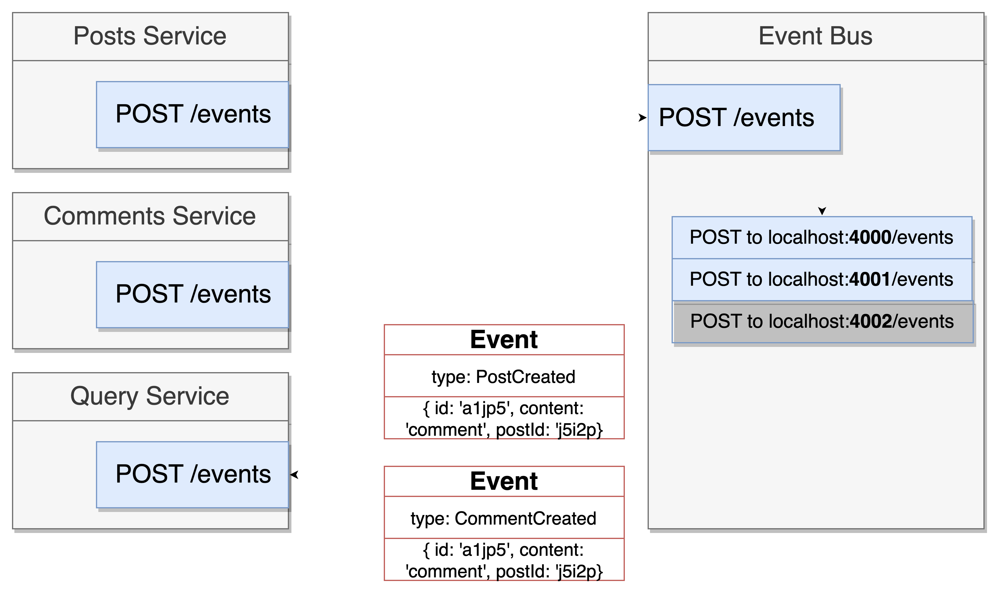
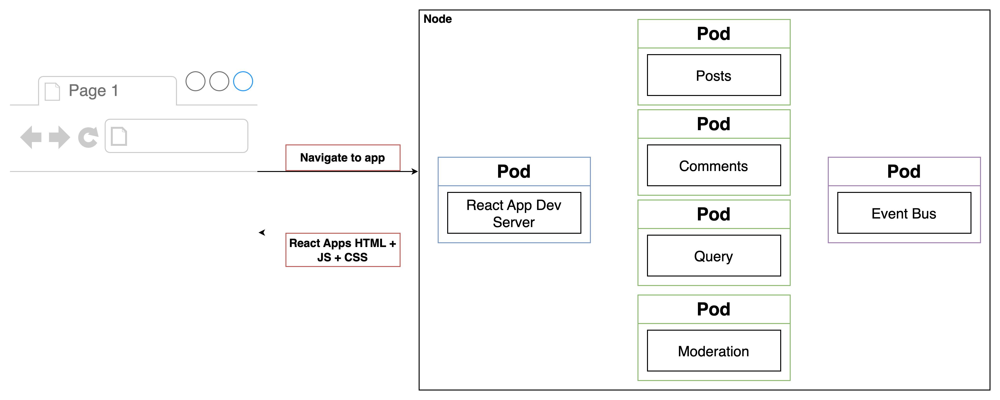
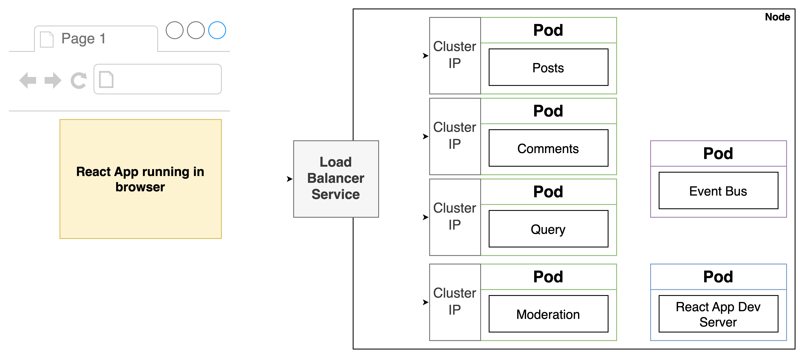
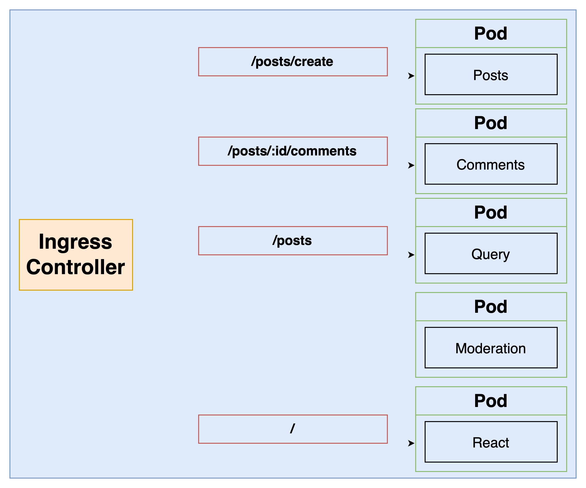

# Blog Application
## Description
This is a simple blog application that allows users to create blog posts. It also allows users to create comments on blog posts. All comments are moderated before they are published.
Comments containing the word "orange" are rejected.

The application is built using React.js as frontend and Node.js as backend.
No database is used in this application. All data is stored in memory.
## Technologies
This application employs microservices architecture. We built an event-bus service to handle the asynchronous communication between services. Each service publishes an event to the event-bus service and the event-bus service broadcasts the event to the interested services.
While other services are stateless, the query service is stateful. It stores the data of all posts and comments in memory. The query service is used to retrieve the data of all posts and comments.


The blog application contains the following services:
- Frontend: React.js
  - Client: the client service is used to render the user interface. It is built using React.js.
- Backend: Node.js
  - Event Bus: it is a Node.js service that handles the asynchronous communication between services. Each service publishes an event to the event-bus service and the event-bus service broadcasts the event to the interested services.
  - Query: it is a Node.js service that stores the data of all posts and comments in memory. It is used to retrieve the data of all posts and comments and passes to the frontend.
  - Moderation: The moderation service is used to moderate the comments. It checks if the comment contains the word "orange". If so, the comment is rejected. Otherwise, the comment is accepted.
  - Comments: The comments service is used to create comments on posts. It publishes an event to the event-bus service when a comment is created.
  - Posts: The posts service is used to create posts. It publishes an event to the event-bus service when a post is created.
The following image shows how events are handled in the application:



Each service is deployed in a separate Docker container and all services are orchestrated using Kubernetes.
The following image shows the node architecture of the application:


Ingress-nginx is applied to create a load balancer so that the services can be reached out from the browser:


The routing rules are defined in the Ingress Controller as follows:


## How to run the application
### Prerequisites
#### Install Docker and Kubernetes
To run the application, you need to have Docker and Kubernetes installed on your machine. If you are in Windows or MacOS, you can run Kubernetes with Docker Desktop.
You can use Minikube to run Kubernetes locally on Linux.
#### Install kubectl
kubectl is used to manage Kubernetes. You can install it using the following command:
```bash
sudo apt-get update && sudo apt-get install -y apt-transport-https gnupg2 curl
curl -s https://packages.cloud.google.com/apt/doc/apt-key.gpg | sudo apt-key add -
echo "deb https://apt.kubernetes.io/ kubernetes-xenial main" | sudo tee -a /etc/apt/sources.list.d/kubernetes.list
sudo apt-get update
sudo apt-get install -y kubectl
```
Details can be found here: https://kubernetes.io/docs/tasks/tools

#### Install Ingress-nginx
Ingress-nginx is used to create a load balancer for the application. You can install it using the following command:
```bash
kubectl apply -f https://raw.githubusercontent.com/kubernetes/ingress-nginx/controller-v0.44.0/deploy/static/provider/cloud/deploy.yaml
```
Check the document of Ingress-nginx for more details: https://kubernetes.github.io/ingress-nginx/deploy/#quick-start
#### Install Skaffold
Skaffold is used to automate the deployment of the application. You can install it using the following command:
```bash
curl -Lo skaffold https://storage.googleapis.com/skaffold/releases/latest/skaffold-linux-amd64 && chmod +x skaffold && sudo mv skaffold /usr/local/bin
```
Check the document of Skaffold for more details: https://skaffold.dev/docs/install/

#### Port 80
Make sure that you have the port 80 available;
##### Windows
Using Powershell with elevated permissions:
```
netstat -anb
```
Scroll to the top of the returned output and find the listing for port 80. If Docker is properly listening on port 80 you should see:
```
TCP   0.0.0.0:80   0.0.0.0:0   LISTENING

[com.docker.backend.exe]
```
If something else is listed for TCP 0.0.0.0:80, you'll need to shut that service down.

##### macOS
```
sudo lsof -i tcp:80
```
If Docker is properly listening on port 80 you should see something very similar:
```
COMMAND    PID USER   FD   TYPE             DEVICE SIZE/OFF NODE NAME

com.docke 8263 user  113u  IPv6 0xa20e89998489120d      0t0  TCP *:http (LISTEN)
```
If something else is listed for TCP *:http, you'll need to shut that service down.
#### Host file
Tweak host file to add the following entry:
```bash
 cd /etc/hosts
```
Add the following line. Note that you need admin privileges to edit the host file.
```bash
  127.0.0.1 posts.com
```
For minikube, change the IP address to the one returned by the following command:
```bash
minikube ip
```
### Install and run the application
#### 1. Clone the repository
```bash
git clone
```
#### 2. Run the application
```bash
cd blog
skaffold dev
```
#### 3. Access the application
Open the following URL in your browser:
```bash
http://posts.com
```
#### 4. How to run the application in Minikube

```bash
cd blog
skaffold dev --port-forward
```

